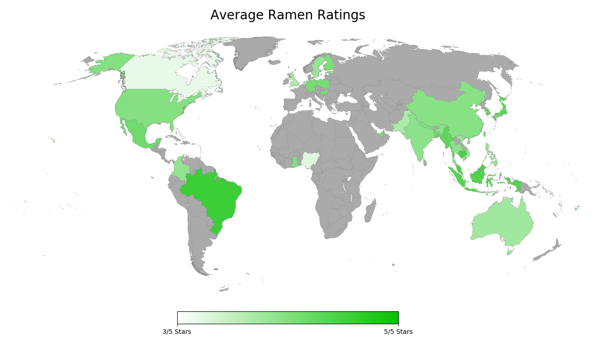
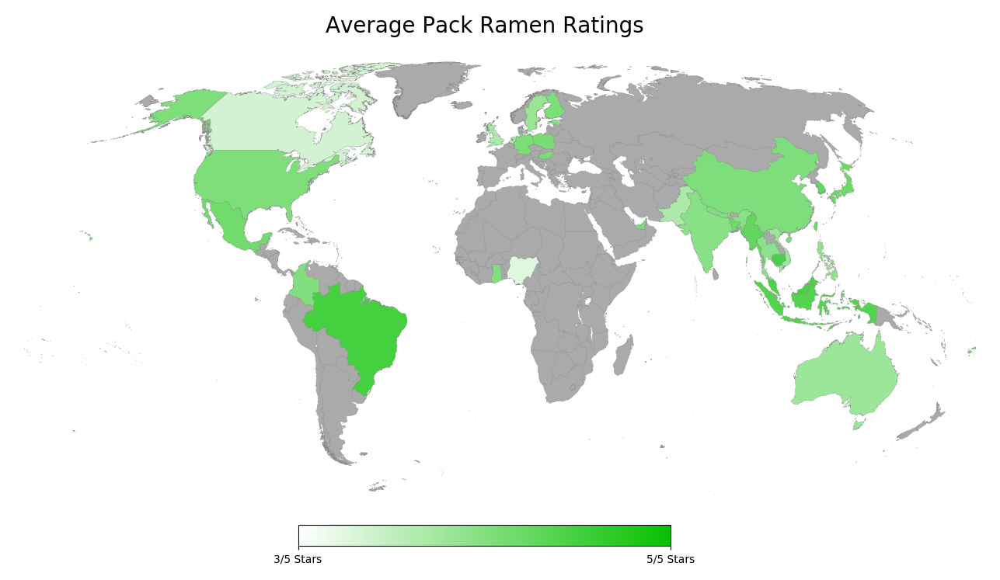

# hot-ramen
A simple data analysis of ramen ratings using [The Ramen Rater's dataset](https://www.theramenrater.com/resources-2/the-list/).

## Dependencies
- NumPy
- Matplotlib
- BaseMap (requires geos)

## Result
Number of Ratings: 2685

### Best and Worst Ratings by Country
| Country | Average Ratings | # of Products |
| -------:|:---------------:|:-----------------:|
| Brazil | 4.35 | 5 |
| Cambodia | 4.20 | 5 |
| Malaysia | 4.17 | 160 |
| Singapore | 4.10 | 121 |
| Indonesia | 4.07 | 141 |
| ...... | ...... | ...... |
| Pakistan | 3.00 | 9 |
| United Kingdom | 3.00 | 69 |
| Netherlands | 2.70 | 19 |
| Nigeria | 2.38 | 2 |
| Canada | 2.26 | 41 |

### Bowl/Cup vs Pack
| Bowl/Cup | Pack |
|:-------------------------:|:-------------------------:|
|   |   |
